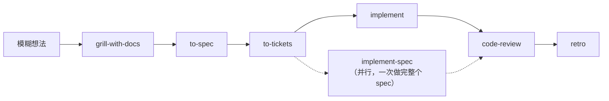

# 更新说明（中文）

这份文档说明本仓库相对 **v1.2.3** 之后累积了哪些更新。

为什么要单独写一份：上游的 [CHANGELOG.md](./CHANGELOG.md) 由 changesets 自动生成，英文、信息密度高，适合查证但不适合快速建立认知。这里用中文按「你受影响的方式」重新组织一遍，让自己和用这个仓库的人都能一眼看出「跟以前比，多了什么、少了什么、我要动什么」。

覆盖范围：`v1.2.3`（2026-08-06）到 `v1.3.0`（2026-09-29）到 `v1.3.1`（2026-10-04），以及 `v1.3.1` 之后已经合并进 `main` 但尚未发版的改动。

## 一分钟速览

| 变更 | 类型 | 你需要做什么 |
| --- | --- | --- |
| 领域文档改名：`CONTEXT.md` 改成 `GLOSSARY.md` | 约定改名 | 老仓库里的同名文件建议一起改；重跑 `/setup-matt-pocock-skills` |
| 新增 `pr` | 新技能（model-invoked） | 不用做什么，写 PR 正文时会自动生效 |
| 新增 `retro` | 新技能（user-invoked） | 会话收尾时可以 `/retro`，让它建议怎么改进 Agent 的工作环境 |
| 新增 `implement-spec` | 新技能（user-invoked） | 一个 spec 想一次性实现完，用 `/implement-spec` |
| 删除 `resolving-merge-conflicts` | 移除技能 | 不要再调用它，冲突交给 Agent 常规处理即可 |
| 新增 `chief-of-staff` | 新技能（in-progress） | 想试用要单独安装，不进 plugin |
| 本仓库自己加的 `show-me` | 新增技能（in-progress） | 跟随本仓库安装即可，见 [README](./README.md) |

一句话总结：**主流程多了一个收尾步骤 `retro` 和一个并行实现入口 `implement-spec`，PR 正文有了统一规范 `pr`，领域文档从「上下文」改叫「术语表」，并且删掉了一个不再需要的技能。**

## 一、最需要留意的改动：领域文档改名

这是唯一会让**已有仓库**产生实际动作的改动，放在最前面。

| 以前 | 现在 |
| --- | --- |
| `CONTEXT.md` | `GLOSSARY.md` |
| `CONTEXT-MAP.md` | `GLOSSARY-MAP.md` |

**为什么改**：这套文档的职责是统一术语，让 Agent 和人用同一个词。它从来不是「项目的全部上下文」，叫 `CONTEXT` 会让 Agent 误以为读它就能了解整个项目。改成 `GLOSSARY` 是在名字上把职责说准。

**影响面**：全部会读写这份文档的技能，包括 `domain-modeling`、`grill-with-docs`、`improve-codebase-architecture`、`setup-matt-pocock-skills`、`triage`、`tdd`、`diagnosing-bugs`、`ask-matt`、`codebase-design`、`wait-what`、`pr`。

**怎么办**：

- 新仓库不用管，技能会自动用新名字。
- 老仓库里已经有 `CONTEXT.md` 的，把它改名成 `GLOSSARY.md`，内容不用动。
- 跑一次 `/setup-matt-pocock-skills`，让 `docs/agents/` 下的配置指向新文件名。

## 二、新增的三个技能

### `pr`：PR 正文该长什么样

model-invoked，写 PR 时自动生效。它规定 PR 正文的三段结构：

1. **Summary**：用最小的可视化把改动讲清楚（伪代码、调用树、文件树、Mermaid、diff，视情况选）。
2. **Evidence**：前后对照的验证证据，证明它真的能工作。
3. **Merge danger**：这是一扇单向门还是双向门，影响半径多大。

有意思的一点：它的 Summary 视觉部分正是改编自 `show-me`（本仓库额外加入的那个技能），出处记在它自己的 `CREDITS.md` 里。

### `retro`：会话结束后的复盘

user-invoked，位置在主流程最后一步，`/code-review` 之后。它回顾一次会话，但**不提代码意见，只提对 Agent 工作环境的改进**：导航指针、自动化检查、编码规范、steering 文件、工具取舍、信息获取方式。

它有个明确的分类动作：一条规范如果属于机械违规，就应该变成确定性检查（lint 规则、pre-commit 钩子或 CI job）；只有真正需要判断力的才留在 `CODING_STANDARDS.md` 里。一个仓库完全没有护栏，本身就是一条发现。

### `implement-spec`：一个 spec 一次做完

user-invoked。它是 `implement` 的并行版本：

| | `implement` | `implement-spec` |
| --- | --- | --- |
| 粒度 | 一次一个 ticket | 整个 spec |
| 组织方式 | 按 ticket 顺序 | 把 tickets 当**任务图**，在就绪的 frontier 上并行 |
| 落点 | 每个 ticket 各自收尾 | 汇总到一条**集成分支** |
| 收尾 | `/code-review` | `/code-review` |

它不再默认开 PR：目标是集成分支本身。只有当 issue tracker 是以 PR 关单的工作流，或者你主动要求时，才会开一个 draft PR。

## 三、被移除的技能

**`resolving-merge-conflicts` 已删除**，没有替代品。理由是这个技能本身没必要存在：Agent 处理进行中的 merge 或 rebase 冲突，不需要专门技能。

它同时从 plugin、README 和 `ask-matt` 路由里移除了。文档页 `aihero.dev/skills-resolving-merge-conflicts` 仍然在线，但标记为归档。

如果你以前习惯敲这个命令，现在直接让 Agent 解决冲突即可。

## 四、主流程现在是这样

两个新增入口的位置：

- `retro` 挂在 `code-review` 之后，是主流程的收尾。
- `implement-spec` 和 `implement` 并列，是 `to-tickets` 之后的另一条实现路线，产出的东西最终也回到 `code-review`。

## 五、其他修正（按影响排序）

这些都是「不影响你调用方式，但会明显改善体验」的修正。

### 技能之间怎么互相调用

以前技能在正文里写「运行 `/tdd` 技能」这种话，实际触发率很低。现在统一改成明确指示：**调用 Skill 工具，名称为 `tdd`**。同时修掉了一批违反「user-invoked 技能不能被其他技能调用」这条不变式的引用。

对应的，`implement` 现在通过 Skill 工具调用 `tdd` 和 `code-review`，不再靠散文里的斜杠命令。

### 文本风格：全仓库清理 em-dash

仓库的 prose（`SKILL.md`、docs、README、ADR、changeset、代码注释）里不再允许英文长破折号（em-dash），遇到就重写句子，用逗号、冒号、句号、括号或连词代替，而不是机械替换字符。

这条规则现在写进了 `CLAUDE.md`（也就是 `AGENTS.md`）。改文档时注意。另外几个技能的 frontmatter `description` 补上了引号，修掉了一次批量替换留下的 YAML 语法错误。

### 提问方式的修正

- `grilling`：每个问题的措辞都调整成「回答 yes 就等于接受推荐答案」，避免「同意」被理解成「同意但不采纳推荐」。
- `grilling`：连续问题之间加分隔线，不再挤在一起。
- `tdd`：每个提议的 seam 要附一句「它能拦住什么、拦不住什么」，让选 seam 不再是靠猜。

### 各技能的修复

| 技能 | 修了什么 |
| --- | --- |
| `ask-matt` | 先读对方的 `SKILL.md` 再下结论，不再只依赖自己那行摘要；bug 修完之后指向 `/retro` 而不是已经删掉的那步 |
| `code-review` | 主动在仓库里搜规范文件并把 `CODING_STANDARDS.md` / `CONTRIBUTING.md` 交给 Standards 子 Agent；两个子 Agent 改为前台运行并使用其返回的报告；issue tracker 通过配置文档解析 |
| `diagnosing-bugs` | 信任「测试变红」之前，先对一份干净副本做 diff，证明这次改动真的生效了，避免改了等于没改却当成失败测试 |
| `implement` | 拿到 ticket 引用后先去 tracker 取回并说出标题再动手；引用有歧义就发问 |
| `teach` | 工作区写在你运行它的目录，而不是技能自己的目录；测验里正确答案的位置会变化 |
| `handoff` | 明确说出系统临时目录的位置（`$TMPDIR`，否则 `/tmp`；Windows 是 `%TEMP%`），不再让 Agent 猜 |
| `to-tickets` | 每个 ticket 成为来源 issue 的 sub-issue；blocker 是原生依赖关系时省略 `## Blocked by` 段 |
| `wayfinder` | 不再给 map 和 ticket 打 `ready-for-agent` 标签；交叉引用只写真实存在的 issue id；research 分支不开 PR；按标签声明的类型解析 ticket |
| `wizard` | 模板脚本修复一批：方向键可用、`.env` 写入加单引号以保住空格与 `#`、无浏览器打开器时给出提示、支持软链的 `.env` 并保留文件权限、EOF 时报错而不是死循环 |
| `setup-matt-pocock-skills` | 自动创建缺失的 triage 标签（GitHub / GitLab）；修 GitLab 的 `glab` 命令；GitHub issue 用 `--json` 读以免丢标签和正文 |

> 后四项（`to-tickets`、`wayfinder`、`setup-matt-pocock-skills`、`code-review`）涉及 tracker 配置，**建议重跑一次 `/setup-matt-pocock-skills`** 来刷新 `docs/agents/`。

### 仓库自身的变化

- 新增 `SCOPE.md`：说明这个仓库负责什么、不负责什么。
- 新增 GitHub issue 模板（bug / idea）和两个自动化 workflow（`needs-info`、`triage-label`）。
- 新增 `.out-of-scope/` 记录：明确排除在范围外的议题，避免反复讨论（例如 subagent 递归属于 harness 的职责，不是技能的职责）。
- 全部 docs 页做了一次「去 AI 味」重写，删掉套话。
- 新增 in-progress 技能 `chief-of-staff`：在单个会话里调度子 Agent 和计划，推进一个长期目标。属于试验性质，上游尚未列入 in-progress 的 README 清单，本仓库补上了。

### 本仓库自己的处理

上游的 `.github/workflows/release.yml` 是给 mattpocock/skills 自己发版用的：changesets 机器人会在仓库里开一个 "chore: version skills" 的 PR，合并后再打 tag、发 GitHub Release。

这个流程在本仓库没有意义，而且会直接失败：fork 默认不允许 GitHub Actions 创建 PR，所以机器人把 `changeset-release/main` 分支推上来之后，就卡在开 PR 这一步，Actions 页留一个红叉。它生成的 changelog 还硬编码指向 `mattpocock/skills`。

处理方式：给这个 job 加了 `if: github.repository == 'mattpocock/skills'`，只在上游仓库运行，fork 里显示为 skipped。本仓库跟随上游合并，`CHANGELOG.md` 由上游维护，不需要自己发版。

## 六、版本时间线

| 版本 | 日期 | 内容 |
| --- | --- | --- |
| `v1.2.3` | 2026-08-06 | 本仓库的起点基线 |
| `v1.3.0` | 2026-09-29 | 毕业 `implement-spec`、`pr`、`retro`；删除 `resolving-merge-conflicts`；`CONTEXT.md` 改名 `GLOSSARY.md`；跨技能调用改为 Skill 工具；全仓库清理 em-dash |
| `v1.3.1` | 2026-10-04 | 修正 `ask-matt` 的过时跳转，改为指向 `/retro` |
| `main`（未发布） | 2026-10 之后 | 上表「其他修正」中的大部分，以及 `chief-of-staff` |

## 七、升级检查清单

- [ ] 老仓库的 `CONTEXT.md` / `CONTEXT-MAP.md` 改名成 `GLOSSARY.md` / `GLOSSARY-MAP.md`。
- [ ] 重跑 `/setup-matt-pocock-skills`，刷新 `docs/agents/` 下的 tracker 与标签配置。
- [ ] 确认不再有脚本或文档调用 `/resolving-merge-conflicts`。
- [ ] 主流程记忆更新：`code-review` 之后多一步 `retro`（可选）。
- [ ] 实现路线记忆更新：ticket 少时用 `/implement`，一个 spec 想一次做完用 `/implement-spec`。
- [ ] 如果本仓库是从上游 fork 出来的，定期 `git fetch upstream && git merge upstream/main` 跟上进度。
