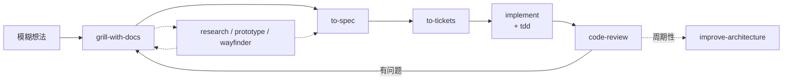

# 给真实工程师的 Agent Skills

这是一套基于 Matt Pocock `skills` 思想整理的 Agent Skills。它服务的是把软件工程基本功变成可重复的协作习惯：持续对齐、快速反馈、垂直切片、测试驱动和保持代码设计。

这份 README 是我对这套 skills 的使用与理解，不是 Matt Pocock 的官方中文版，也不替代各 skill 自己的说明。后续会根据实际使用中的反馈、面试交流和工程实践持续修正与演进。

我对这套方法的理解是：它不是一条瀑布式流程，也不是文档驱动开发。它更像一组可以组合的反馈循环。文档、工单和术语都只是持久化共识的载体，真正的目标是让人和 Agent 对问题、边界和验收方式达成一致，并用足够快、足够干净的反馈把实现逐步收敛。

## 它解决什么问题

AI coding 最常见的失败，是上下文和反馈出了问题。

| 常见失真 | 对应的处理方式 |
| --- | --- |
| 需求只有一句话，Agent 只能猜 | 用 `grill-me` 或 `grill-with-docs` 逐个追问，暴露取舍和边界 |
| 重要决策只存在于一次对话里 | 用 `to-spec` 把共识写成可交接的目的地文档 |
| 一个大任务无法验收，也无法并行 | 用 `to-tickets` 拆成可独立验证的 tracer-bullet 工单，并标出 blocking 关系 |
| 设计在文字里想不清楚 | 用 `prototype` 提高保真度，用可丢弃代码回答问题 |
| Agent 写完一大坨代码才发现方向错了 | 用 `tdd` 建立 red-green-refactor 反馈环，一次推进一个垂直切片 |
| 评审被长对话里的错误假设污染 | 在 fresh context 中用 `code-review`，分别检查规范和需求 |
| 代码越改越难改 | 定期用 `improve-codebase-architecture` 寻找 deepening 机会 |

核心原则可以压缩成一句话：**先把问题问清楚，再用最短反馈环验证它；不要把“写了很多文档”误认为“已经完成设计”。**

## 30 秒看懂主流程



这张图不是必须照做的阶段顺序。小改动可以直接 `implement`，复杂问题可以在 `wayfinder` 中建立决策地图。每一步存在的理由，是缩短反馈距离，减少 Agent 猜测，而不是增加流程仪式感。

## 三分钟开始

### 1. 安装

```bash
npx skills@latest add yuezi2048/skills
```

安装器会让你选择要安装的 skills，请确保包含 `setup-matt-pocock-skills`。并检查是否重复安装，避免同一个 skill 被加载两次，产生难以解释的行为。

### 2. 初始化项目

在每个项目中运行一次：

```text
/setup-matt-pocock-skills
```

它会确定 issue tracker、triage 标签和领域文档的位置。之后 `to-spec`、`to-tickets`、`triage` 等工程技能才能把产物放到团队真正使用的地方。

### 3. 最短链路

```text
/grill-me
/to-spec
/to-tickets
/implement
/code-review
```

如果需求还没有形成共识，先不要让 Agent 实现。若问题大到一次会话无法容纳，先用 `/wayfinder` 把未知决策拆开。

## 我理解的关键思想

### 1. 从流程转向反馈循环

传统流程容易被理解成“先写完整 spec，再一次性生成代码”。这套 skills 的重点不同：共识在 grilling 中形成，研究和原型用来消除未知，实现阶段依靠测试和 QA 持续修正。

因此，`spec` 不是详细设计的替代品，也不是写完就不能改变的合同。它记录问题、目标、用户故事、重要决策、测试决策和明确不做什么，让下一个会话能重建上下文。真正的设计仍然要在代码和反馈中接受检验。

### 2. 统一语言让 Agent 更少猜

`grill-with-docs` 和 `domain-modeling` 会维护领域术语、`GLOSSARY.md` 与 ADR。人和 Agent 使用同一套词，模块、函数和测试的命名就有了共同依据。

例如，先约定 `ghost`、`real`、`materialize`、`materialization cascade` 的含义，再讨论课程功能。这样比每次重新解释“数据库里有但磁盘里没有的课程”更精确，也更省上下文。

### 3. Prototype 是高保真度的提问

有些问题不是继续讨论就能解决的，例如“这个 UI 用起来顺不顺”“状态机的转移是否自然”。生产代码便宜之后，先写一个 throwaway prototype 往往比继续扩写 spec 更快得到答案。

原型可以是 UI 变体，也可以是后端状态模型或命令行逻辑。它的价值不在于直接合并，而在于把“我想看看它运行起来是什么样”变成可观察的反馈。

### 4. TDD 是防止 AI 作弊的边界

`to-tickets` 产生的是能验收的垂直切片，`tdd` 则为每个切片建立 red-green-refactor 回路：先写失败测试，再实现最小行为，最后整理设计。测试是 Agent 无法靠口头解释绕过的反馈源，也是让重构不会破坏既有行为的耐久接口。

### 5. Fresh context 让评审保持诚实

长对话会积累错误假设，也会让评审者下意识替实现找理由。`code-review` 从固定点读取 diff，在 Standards 和 Spec 两条轴上独立检查。它的目的不是增加一个审批环节，而是让反馈更快、更干净，更难被错误上下文掩盖。

## 如何选择入口

| 你现在的情况 | 从这里开始 |
| --- | --- |
| 不知道该用哪个 skill | [`ask-matt`](./skills/engineering/ask-matt/SKILL.md) |
| 有想法但需求模糊 | [`grill-me`](./skills/productivity/grill-me/SKILL.md) |
| 想在追问中同步沉淀术语和决策 | [`grill-with-docs`](./skills/engineering/grill-with-docs/SKILL.md) |
| 工作量超过一次会话，未知决策很多 | [`wayfinder`](./skills/engineering/wayfinder/SKILL.md) |
| 需要验证 UI 或逻辑形态 | [`prototype`](./skills/engineering/prototype/SKILL.md) |
| 已有共识，需要形成目的地文档 | [`to-spec`](./skills/engineering/to-spec/SKILL.md) |
| 已有 spec，需要可执行切片 | [`to-tickets`](./skills/engineering/to-tickets/SKILL.md) |
| 想测试驱动实现 | [`tdd`](./skills/engineering/tdd/SKILL.md) |
| 已完成一段实现，需要独立评审 | [`code-review`](./skills/engineering/code-review/SKILL.md) |
| 正在定位复杂 bug 或性能回归 | [`diagnosing-bugs`](./skills/engineering/diagnosing-bugs/SKILL.md) |
| 不确定术语或需要更新领域模型 | [`domain-modeling`](./skills/engineering/domain-modeling/SKILL.md) |
| 看不懂现状，或需要把现有流程讲清楚 | [`show-me`](./skills/in-progress/show-me/SKILL.md) |
| 需要把当前会话交给另一个 Agent | [`handoff`](./skills/productivity/handoff/SKILL.md) |

## 技能地图

技能按两个维度组织：按工程领域分 bucket，按谁可以触发分 invocation。**User-invoked** 只能由人主动输入，负责编排和关键入口；**Model-invoked** 可以由 Agent 根据任务自动调用，负责可复用的工程纪律。

### Engineering

**User-invoked**

- [`ask-matt`](./skills/engineering/ask-matt/SKILL.md)：根据当前情况选择入口。
- [`grill-with-docs`](./skills/engineering/grill-with-docs/SKILL.md)：追问需求，同时更新术语、`GLOSSARY.md` 和 ADR。
- [`triage`](./skills/engineering/triage/SKILL.md)：按状态机评估和分流 issue、PR。
- [`improve-codebase-architecture`](./skills/engineering/improve-codebase-architecture/SKILL.md)：周期性扫描架构深化机会。
- [`setup-matt-pocock-skills`](./skills/engineering/setup-matt-pocock-skills/SKILL.md)：每个仓库首次使用前完成配置。
- [`to-spec`](./skills/engineering/to-spec/SKILL.md)：把当前已讨论的共识写成 spec。
- [`to-tickets`](./skills/engineering/to-tickets/SKILL.md)：把 spec 拆为带依赖的垂直切片。
- [`implement`](./skills/engineering/implement/SKILL.md)：按 spec 或 tickets 实现，并接入 TDD 和评审。
- [`implement-spec`](./skills/engineering/implement-spec/SKILL.md)：在一个集成分支上实现整个 spec，把 tickets 当任务图并行推进，收尾接评审。
- [`wayfinder`](./skills/engineering/wayfinder/SKILL.md)：为超大任务建立共享决策地图。
- [`retro`](./skills/engineering/retro/SKILL.md)：会话结束后，按严重程度提出对 Agent 环境的改进建议。

**Model-invoked**

- [`prototype`](./skills/engineering/prototype/SKILL.md)：用可丢弃原型回答设计问题。
- [`diagnosing-bugs`](./skills/engineering/diagnosing-bugs/SKILL.md)：按“复现、缩小、假设、观测、修复、回归测试”诊断复杂故障。
- [`research`](./skills/engineering/research/SKILL.md)：基于高可信来源完成技术调研并留下引用。
- [`tdd`](./skills/engineering/tdd/SKILL.md)：执行 red-green-refactor。
- [`domain-modeling`](./skills/engineering/domain-modeling/SKILL.md)：维护领域语言、`GLOSSARY.md` 和 ADR。
- [`codebase-design`](./skills/engineering/codebase-design/SKILL.md)：设计 deep module 和可测试的 seam。
- [`code-review`](./skills/engineering/code-review/SKILL.md)：从 Standards、Spec 两条轴独立评审。
- [`pr`](./skills/engineering/pr/SKILL.md)：规定 PR 正文的形状，用最小可视化说明改动、附前后对照证据，并给出合并风险判断。
- [`wizard`](./skills/engineering/wizard/SKILL.md)：生成只需要人操作的交互式 bash 向导。

### Productivity

**User-invoked**

- [`grill-me`](./skills/productivity/grill-me/SKILL.md)：对计划或设计进行持续追问。
- [`handoff`](./skills/productivity/handoff/SKILL.md)：把当前会话压缩成交接文档。
- [`teach`](./skills/productivity/teach/SKILL.md)：在多个会话中进行有状态教学。
- [`to-questionnaire`](./skills/productivity/to-questionnaire/SKILL.md)：把无法独自回答的决策整理成问卷。
- [`wait-what`](./skills/productivity/wait-what/SKILL.md)：当信息没有被理解时要求 Agent 换一种方式重讲。

**Model-invoked**

- [`grilling`](./skills/productivity/grilling/SKILL.md)：所有追问型技能共用的底层访谈能力。
- [`writing-for-agents`](./skills/productivity/writing-for-agents/SKILL.md)：编写给 Agent 消费的 skills、AGENTS.md 和相关文档。

### In progress

beta 中的技能：公开征求意见，不进 plugin，也可能随时改动或消失。

- [`loop-me`](./skills/in-progress/loop-me/SKILL.md)：在多个会话中把想构建的工作流追问成可实现的 spec。
- [`writing-beats`](./skills/in-progress/writing-beats/SKILL.md)：把文章组织成一段段 beat 的旅程，一次只写一段。
- [`writing-fragments`](./skills/in-progress/writing-fragments/SKILL.md)：通过追问挖掘写作碎片，追加到同一份素材文档。
- [`writing-shape`](./skills/in-progress/writing-shape/SKILL.md)：把素材 markdown 逐段塑造成文章，并论证每一步的格式选择。
- [`claude-handoff`](./skills/in-progress/claude-handoff/SKILL.md)：把当前会话交给新的后台 Agent，用 handoff 摘要立即接手。
- [`setup-ts-deep-modules`](./skills/in-progress/setup-ts-deep-modules/SKILL.md)：用 dependency-cruiser 把 TypeScript 仓库约束成 deep module。
- [`chief-of-staff`](./skills/in-progress/chief-of-staff/SKILL.md)：在单个会话中调度子 Agent 与计划，推进一个长期目标。
- [`show-me`](./skills/in-progress/show-me/SKILL.md)：用最小的视图把当前话题讲清楚；当话题是整个项目时，产出一组互相链接、可离线打开的 HTML 图纸。

## 设计边界

- 小而明确的改动不必强行走完整链路，反馈环应当比流程更重要。
- `to-spec` 记录决策和验收边界，不记录容易过时的代码路径和大段实现代码。
- `to-tickets` 默认按垂直切片拆分，一个 ticket 应能独立验证；互不阻塞的 frontier 才适合并行。
- `prototype` 默认是用完即弃的探索物，不应未经判断直接当作生产代码。
- `code-review` 的独立上下文只隔离对话，不隔离文件系统；并行实现仍需要分支、worktree 和文件所有权约束。
- skill 不会替用户授权 push、merge、部署或关闭 issue。
- 验证强度跟随风险，低风险改动不机械要求全量测试，高风险逻辑必须覆盖对应验证面。

## 来源与定位

本仓库遵循 [Matt Pocock 的 skills](https://github.com/mattpocock/skills) 的核心思想，并结合中文笔记中的学习和实践理解进行说明。除上游技能外，本仓库额外加入了 [`show-me`](./skills/in-progress/show-me/SKILL.md)（in-progress）；其余目录中的实现仍以各自的 [`SKILL.md`](./skills/engineering/README.md) 为准，本 README 的职责是帮助读者快速理解整套方法如何工作。

这套方法最适合这样描述：**人负责把“要解决什么问题、为什么这样解决、做到什么算完成”说清楚，Agent 负责在快速反馈中实现、验证和修正。**

## 许可

本项目沿用上游 MIT License，详见 [`LICENSE`](./LICENSE)。
