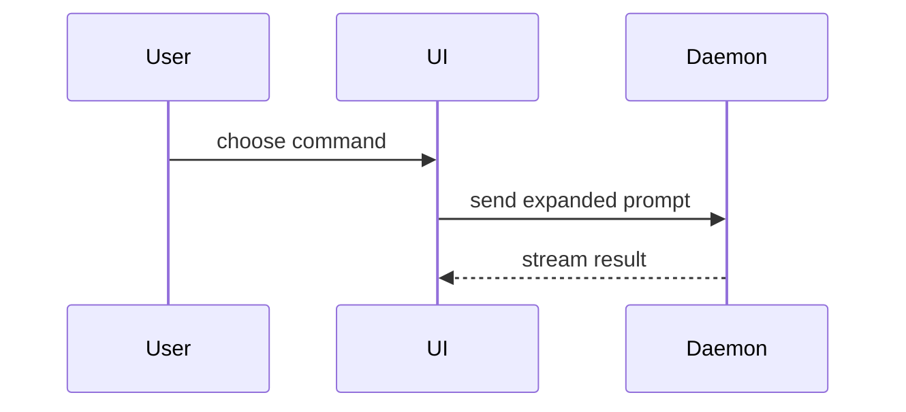

# Show Me

Help the user understand the current topic visually. Skip the preamble and keep prose brief. Pick the smallest view that makes the key point clear.

## Pick the smallest view

- Show logic or an algorithm as pseudocode:

```text
on(save)
  if content is unchanged
    return cached result
  write new content
  return fresh result
```

- Show runtime control flow as a call tree:

```text
submitForm
  createSession
    persistPrompt
    launchAgent
  navigateToSession
```

- Show UI structure as a component tree, including state and module boundaries that matter:

```tsx
<SessionPage> (apps/example/src/routes/session.tsx)
  useSessionEvents()
  <SessionToolbar>
    <RunSkillButton> (packages/ui)
```

- Show file responsibility or a broad refactor as a shallow file tree:

```text
src/
├── commands/       # parses user actions
├── sessions/       # owns session state
└── transport/      # sends API requests
```

- Show component interaction, control flow, or data flow with Mermaid:



- Use `diff` when the point is what changes and the surrounding shape already exists. Match the diff shape to the topic.

For a component change:

```diff
 <SessionPage>
   useSessionEvents()
   <SessionToolbar>
+    <RunSkillButton />
   <SessionTimeline>
+    <SkillResultCard />
```

For a file-layout change:

```diff
 src/
 ├── commands/
+│   └── show-me.ts       # expands the slash command
 ├── sessions/
-└── transport.ts
+└── transport/
+    ├── client.ts
+    └── stream.ts
```

For a call-tree or call-stack change:

```diff
 submitForm
   createSession
     persistPrompt
+    expandSkillMention
     launchAgent
-  navigateToSession
+  navigateToSession
+    subscribeToEvents
```

For a state or control-flow change:

```diff
 on(save)
-  write content
+  if content is unchanged
+    return cached result
+  write new content
+  invalidate cache
```

- Show the whole block when most of it is new, when omitted context would hide ownership or order, or when the user needs a copyable target shape:

```ts
function expandSkill(command: string): string {
  const skillName = command.slice(1)
  return `use the ${skillName} skill`
}
```

- For a visual UI, layout, state comparison, or a concept too dense for Mermaid, write one focused HTML file: a diagram, an infographic, or a short slide deck, whichever fits the point. Match the product's colors, type, spacing, and components; use real labels and data; support desktop and mobile. Then open it for the user with the platform opener (`xdg-open` on Linux, `open` on macOS):

```
xdg-open path/to/show-me-{description}.html
```

## When the topic is a set, not a single view

One question usually wants one view. A whole project, or a subsystem the user has to present to someone else, wants a **set** of diagrams that reads as a single document. Sets follow the house rules below.

### Shape

- One self-contained HTML file per diagram. No CDN and no network calls: it must open offline, print to PDF, and stay readable on desktop and mobile.
- Sequence diagrams put a **numbered gutter down the left** and every explanation in **numbered footnotes under the diagram**, never inside the flow. The steps stay a clean chain and the reading happens below them.
- Structure diagrams use sectioned cards with semantic color, and each section carries a label for how far it is actually built.
- Cross-link the pages so the set can be walked as a whole.

### Content

- Every label, field name, class name, and endpoint path comes from the code. Never let design intent stand in for what the code does today, and say on the diagram which one you are showing.
- When the docs and the code disagree, mark the gap on the diagram, then write the correction back to wherever the project keeps its single source of truth for status.
- Mark whether each flow is currently switched on (a feature flag, a write gate) instead of implying everything is live.
- When two paths look like they should be unified, draw them side by side and say why they are not.

### Verify before delivering

- Bold text must not contain a middle dot (`·`): some fonts fall back to a tofu box at that weight. Use a comma or a colon instead.
- Screenshot the file with headless Chrome at a desktop width and at a mobile width, and fix what you see before handing it over.

### guidance

Place each visual next to the short text it supports. Keep only the calls, files, props, states, and boundaries needed to answer the user's current question or the options to resolve the current discussion point.

You may use one of these, you may use several, it is unlikely you will use all of them. Use your judgement and don't overwhelm the user.
